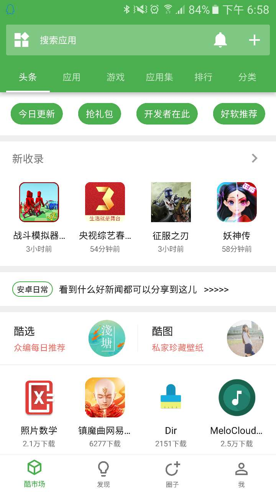
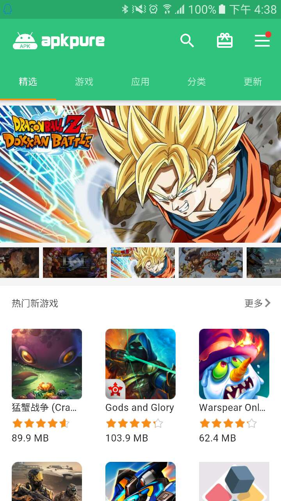
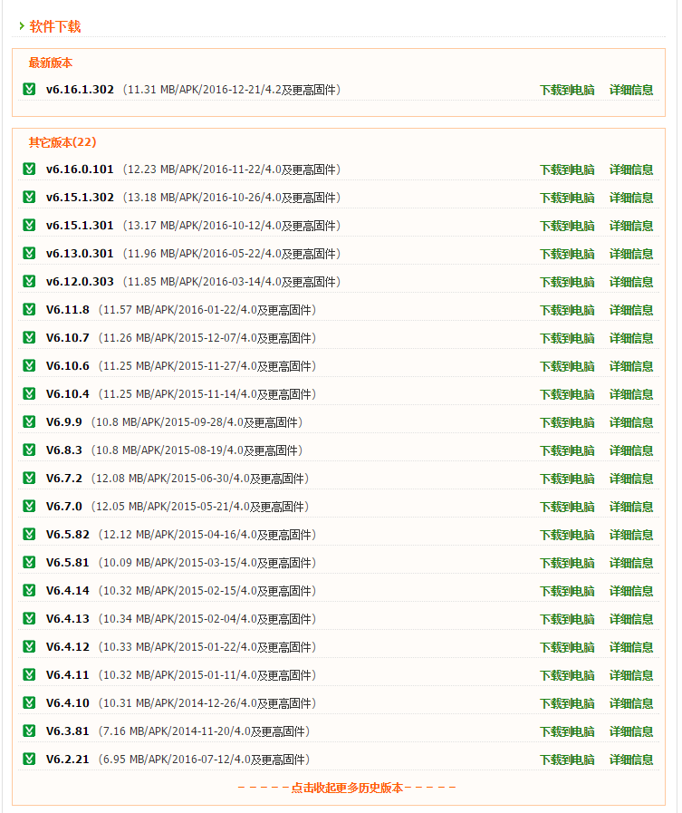
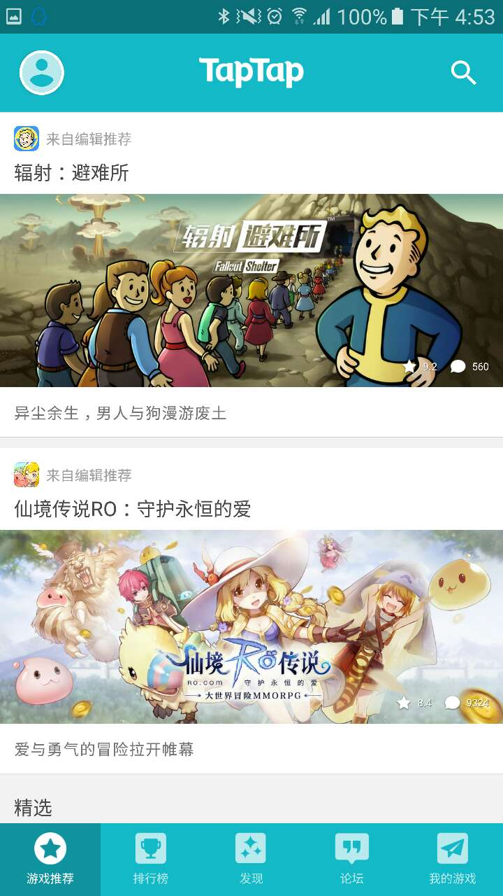
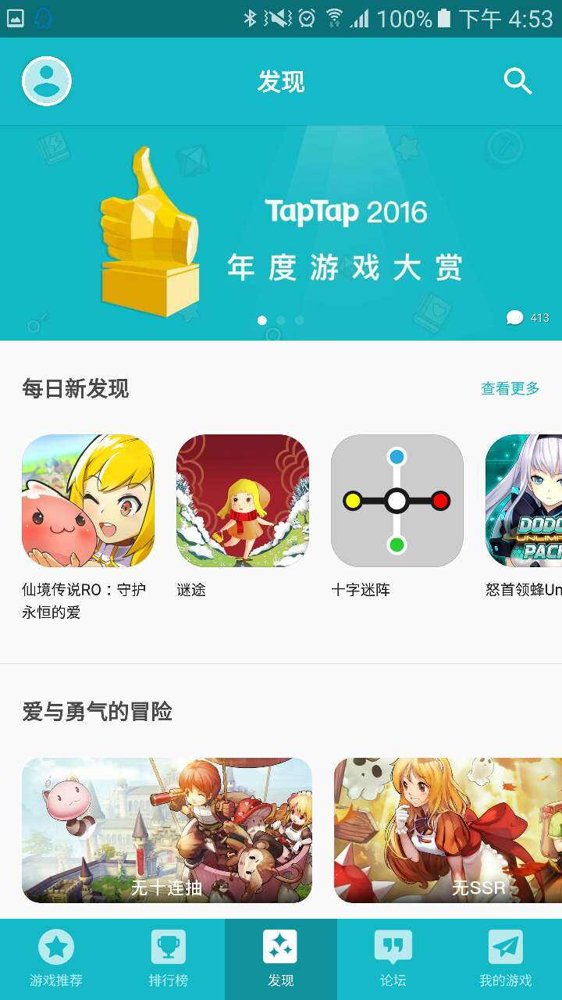
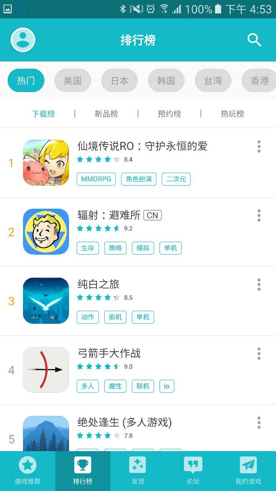

#Android 小众良心的应用市场推荐
>喜欢的朋友可以关注我的简书:http://www.jianshu.com/u/84b6e43503a5我的文章会同步更新的,当然一些专业一点的文章(包含代码片段)只会在我的简书和Github更新.欢迎关注.๑乛◡乛๑
说道应用市场,几乎每一个人都很熟悉,每一部 Android 手机应该都会安装至少一个.

现在主流的 Android 应用市场有很多,比如:腾讯应用宝, 360手机助手, 小米市场, 华为市场等等.

当然我今天肯定不是推荐他们,不然观众还不得打我,━((*′д｀)爻(′д｀*))━!!!!

推荐两款 Android 应用市场

这些用户量可能只有百分之一,但是体验不是流行市场能比的.

###1. 酷市场

官网: http://www.coolapk.com/

这个应该是公认的,客户端比较简洁,最近几个版本才开始变得丰(la)富(ji)起来.

**大家对某个app有依赖,但是还是有些地方感觉不爽,那么你需要去 酷市场 的对应app的评论区看.
比如,哎呀我的这个uc有新闻啊有广告啊,我不爱看而且还费我流量.你需要去看看,没准我惊喜呢! \(≧▽≦)/**

###2. apkPure

官网: https://apkpure.com/cn/
国内无法使用 GooglePlay , apkPure 相当于 GooglePlay 的镜像, GooglePlay 上有的它立马就有了,更新也很快, 至于 它和 GooglePlay 有没有什么 PY (‵▽′)ψ 交易我不知道,反正我知道还真的很好用,有些产品国际版比国内版好用.当然缺点也是有的,就是慢....

小编在它的官网下载它的商店 apk安装包居然失败了,然后我用迅雷把它下载下来了.

如果也有小伙伴下载不下了可以去我分享的网盘里下载:https://pan.baidu.com/s/1mhAKigS

商店截图:

当然,你可以在里面搜索v(红)p(领)n(巾),嗯,就这样.

**顺便说一个市场: 手机乐园**

手机乐园以前的Android 客户端很简陋,小编觉得丑也没下,今天想起来就又下载了,然后又下载掉了.φ(゜▽゜*)♪ 卸载的原因很简单----和酷市场长的太像,但是我还是喜欢酷市场,同样的东西留一个,所以卸载了.当然我卸载的重要原因是电脑网页版的手机乐园是可以下载一个软件的历史版本的,有的软件手贱更新后就非常不喜欢,强迫症更是受不了.比如:华为手机音乐播放器,以前没有联网功能,不知道哪个版本加入了联网功能,而且一进去就自动联网,由于是华为出品的app又是华为手机就不能禁止它联网(root后不算).所以我就去 手机乐园找了个旧版本装上,然后又开心了,音乐播放器你不用联网了,联网不是有网易云吗?(　＾∀＾)

### 3. 推荐一个游戏市场: TapTap

最后给大家推荐一个游戏市场,编辑会几乎每天推荐一款游戏,质量还可以.

这也是一个最早我在一个论坛里看一个台湾妹子推荐的,看着很小清新的样子,和国内来看就是一股清流..

软件截图:

好了,文章的最后再推荐一款市场吧,他就是 **pp助手**.

pp助手在被 阿里 收购之前还是很不错的,功能很简单,现在变得很阿里了,我很不喜欢,但为什么还推荐它呢? 

因为它一天能领一个集分宝,小编发家致富就全靠它了,咳咳~~好吧,真正的原因是它下载速度快,软件也比较全,冷门的没有酷市场多,但是能下载到 apkPure .当然其他几个提到名字的apk也都能下载到.

> 看到这里了,喜欢就点个关注呗๑乛◡乛๑