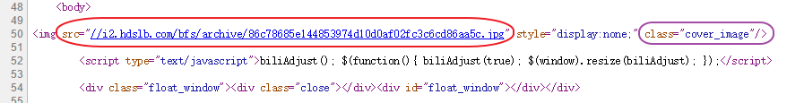

# 如何获取 Bilibili 视频封面 [听说有基佬需要]
> 常逛b站的人就会发现,很多视频封面很是吊人胃口,一致不少绅(bian)士(tai)怒言道: up猪,你出来,交出封面!
> 今天就教你一个简单获取 b站视频封面的小方法.

### 1. 方法一:鼠标右键选择检查

**点开一个b站视频,在该视频页的任意空白地方,鼠标右键--> 选择 检查**

**接下来你会看到这个页面 { 注:这里以chrome浏览器为示例,其他浏览器类似或者使用下文的方法 }**
如果你是 chrome 谷歌浏览器,那么鼠标直接移动到 <body>标签下的上时会有预览图.
**直接点击高亮的地址可以.**

**点击后就可以看到正常大小的视频封面了.**
**现在就可以直接在图片上右键另存为了!**

### 2. 方法二:鼠标右键选择 查看网页源代码

**鼠标右键选择 查看网页源代码,你可以看到这个网页的源码,但是我们没必要去读懂它,我们去找我们需要的视频封面就够了 ๑乛◡乛๑**
右键后选择查看网页源代码:

我截取关键的部分:
**如何快速锁定封面地址的位置? 在该页面 Ctrl + F 然后输入 "cover-image"回车,即可快速达到指定位置.然后得步骤就和上面一样了.**

